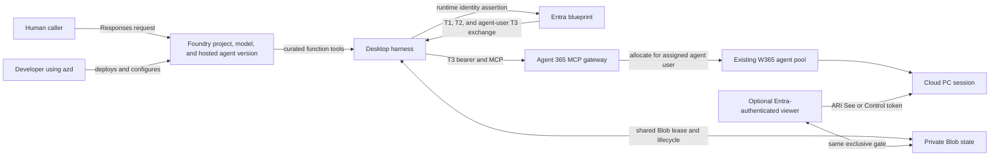

# Computer use with Foundry and Windows 365

A C#/.NET sample in which a **Foundry hosted agent calls Windows 365 tools
directly** through Agent 365's MCP gateway. Agent Framework handles model/tool
iteration. There is no secondary computer-use model, native `computer` tool,
or custom screenshot/action planning loop.

The suggested model is **`gpt.6.astra`**. Set `AZURE_AI_MODEL_DEPLOYMENT_NAME` to
your actual Foundry deployment name. Availability is subscription/region
dependent; the sample does not provision an unverified model SKU. The deployment
must support function calling and image inputs.

> Preview sample, not a production service. W365 onboarding, licenses and paid
> capacity are required. Review [security](SECURITY.md) before using real data.
> [Live acceptance](docs/DEPLOYMENT.md#live-acceptance) is required before publication.

## Included

| Component | Purpose |
| --- | --- |
| Hosted Responses agent | One model discovers allowed W365 schemas and selects desktop/browser/accessibility actions. |
| Desktop harness | Exclusive ownership, readiness polling, cleanup, action/image/time limits and human pause/resume. |
| Companion viewer | Bootstrap locally or on ACA; enabled, Entra-authenticated ACA viewer provides opaque live-view and take-control links. |
| W365 setup | Reuse Foundry's blueprint/agent identity; reconcile consent, inheritance, agent user and existing pool assignment. |
| Deployment | Foundry `azure.yaml`, non-root Docker image, ACA viewer Bicep and deployment guide. |
| Offline tests | Fake MCP/token handlers, ownership, handoff, ambiguous failures and screenshot conversion. |

This sample supports **one operator and one fresh task at a time**. Each task
releases its Cloud PC; subsequent requests do not inherit desktop or image
history. `previous_response_id`, `conversation` and background execution are
rejected. This trades multi-turn desktop continuity for explicit ownership and
bounded screenshot payloads.

## Architecture



`azd` participates in deployment, not runtime authentication. Foundry creates
the blueprint and agent identity with the first hosted version. Tenant setup
then creates or reuses a child **agent user**, assigns that user to an existing
W365 pool, and optionally authorizes an exact hosted-runtime or viewer identity
to federate with the blueprint. The human caller, Foundry caller partition,
agent identity, agent user, pool, and allocated desktop session are distinct.

At runtime the application must turn the hosted agent identity assertion into
blueprint T1, agent T2, and resource-scoped agent-user T3. T3 is the only token
sent to W365. This custom exchange is needed because Foundry Responses hosting
does not natively provide a ready W365 agent-user token. The diagram is the
intended live path; the current validated deployment still stops at the initial
hosted identity assertion, before MCP or Cloud PC allocation.

See [architecture](docs/ARCHITECTURE.md) for the provisioning and runtime
sequence diagrams, [authentication](docs/AUTHENTICATION.md) for token
boundaries, and [validation results](docs/VALIDATION-REPORT.md) for the current
live status.

## Guides

| Goal | Guide |
| --- | --- |
| Verify the sample locally on Windows | [Windows quickstart](#windows-quickstart-no-azure-required) |
| Initialize and deploy the Foundry hosted agent | [Deployment](docs/DEPLOYMENT.md) |
| Bind the deployed Foundry identities to W365 | [W365 setup](docs/W365-SETUP.md) |
| Deploy live view and human handoff | [Viewer](docs/VIEWER.md) |
| Understand identity and token boundaries | [Authentication](docs/AUTHENTICATION.md) |
| Understand ownership, state, and recovery | [Architecture](docs/ARCHITECTURE.md) |
| Review operational and computer-use risks | [Security](SECURITY.md) |
| Contribute and run validations | [Contributing](CONTRIBUTING.md) |

The C# application is organized as a single modular monolith with feature
folders and mirrored tests; see the
[source layout](docs/ARCHITECTURE.md#source-layout).

## Windows quickstart (no Azure required)

This path verifies the complete offline sample without contacting Foundry,
Microsoft Graph, a model, or a Cloud PC.

**Prerequisites:** Windows, [.NET 10 SDK](https://dotnet.microsoft.com/download/dotnet/10.0),
[PowerShell 7.4+](https://learn.microsoft.com/powershell/scripting/install/installing-powershell)
and Git.

Visual Studio is optional. To build `net10.0` inside the IDE, use Visual Studio
2026 version 18.0 or newer. Visual Studio 2022/MSBuild 17 can report `MSB4236`
and claim that `Microsoft.NET.Sdk` or `Microsoft.NET.Sdk.Web` could not be found
even when `dotnet --info` shows the correct .NET 10 SDK and runtime.
The PowerShell quickstart below uses the installed `dotnet` CLI directly and
does not depend on Visual Studio's bundled MSBuild. The checked-in `global.json`
keeps command-line builds on the .NET 10 SDK family while allowing newer .NET 10
feature bands and patches such as `10.0.401`. `Setup-Local.ps1` also warns when
it detects an installed Visual Studio older than 18.0, then continues with the
supported CLI build.

From PowerShell 7 at the repository root:

```powershell
pwsh -NoProfile -File .\scripts\Setup-Local.ps1
pwsh -NoProfile -File .\scripts\Start-Local.ps1
```

The setup command creates `.env` only when it is missing, verifies the required
safe local settings, restores packages, builds a Release binary, and runs all
offline tests. The start command launches that prebuilt binary without another
restore/build, waits for both health endpoints, writes logs under `.local\`,
and stops both processes when you press `Ctrl+C`.

Expected URLs:

| Endpoint | Expected result |
| --- | --- |
| `http://localhost:8088/health` | Agent bootstrap is healthy. |
| `http://localhost:5050/health` | Viewer bootstrap is healthy. |
| Any desktop or Responses route | HTTP 503 until live W365 phase 2 is configured. |

Local mode is unauthenticated and loopback-only. Do not publish or tunnel these
ports. To rebuild without running tests, use
`.\scripts\Setup-Local.ps1 -SkipTests`.

### Windows troubleshooting

| Error | Fix |
| --- | --- |
| `pwsh` is not recognized | Install PowerShell 7.4+, then open a new terminal. Windows PowerShell 5.1 is not supported. |
| The .NET 10 SDK is required | Install the SDK, not only the runtime, then open a new terminal. |
| `MSB4236`, `NETSDK1209`, or Visual Studio says `Microsoft.NET.Sdk(.Web)` is unavailable | The SDK may already be installed, but the IDE's MSBuild is too old. .NET SDK 10.0.401 requires MSBuild 18.0+, while Visual Studio 2022 17.14 supplies MSBuild 17. Close the IDE and run `pwsh -NoProfile -File .\scripts\Setup-Local.ps1`, or upgrade to Visual Studio 2026 18.0+. Installing the standalone SDK does not upgrade Visual Studio's bundled MSBuild. |
| The azd check reports version `1.20.0` after upgrading | `1.20.0` cannot parse this Foundry project, and the current agent/project extensions require `azd 1.32.0+`. Windows may have an older machine-wide `azd` before the current user installation on `PATH`. The check uses the newest compatible installation and prints the exact `$env:Path` command to run before direct `azd` commands. |
| `NU1101` and only `library-packs` is listed | Pull the latest `NuGet.Config`; it clears inherited disabled feeds. |
| `NU1301` or TLS handshake failure for `nuget.org` | The checked-in configuration also uses Microsoft's package-feed proxy for managed Windows environments. Verify your corporate proxy permits it. |
| Port 5050 or 8088 is already in use | Stop the owning process, or run `.\scripts\Start-Local.ps1 -AgentPort 18088 -ViewerPort 15050`. |

## Live quickstart: two-phase deployment

| Phase | Purpose | Current repository validation |
| --- | --- | --- |
| 1. Foundry bootstrap | Deploy the hosted agent with `W365_ENABLED=false`; CUA is unavailable but health, identity discovery, and Foundry hosting are testable | Completed: `win365-desktop-agent` version `1` is active |
| W365 binding | Run `Get-FoundryIdentity.ps1`, then `Setup-W365.ps1` to reconcile consent, create/reuse the agent user, and assign it to an existing W365 agent pool | Completed against existing pool `su-cua-test`; confirm pool readiness in Intune |
| Shared state | Provision the private Blob container and grant the phase-1 agent principal least-privilege data access | Completed: `https://fawin365devstsq53oc.blob.core.windows.net/desktop-state/slot.json` |
| 2. Enable CUA | Apply the returned W365 IDs, Blob/operator settings, set `W365_ENABLED=true`, and deploy the **same agent service** as a new immutable version | Version `6` is active and caller binding passes; live desktop opening is blocked because the hosted runtime cannot acquire the blueprint assertion token |

The phase-2 agent-user ID is configuration, not a credential. Phase 2 updates
the same logical Foundry agent; it does not create a second agent name.
Shared Blob state is an opt-in azd layer created after phase-1 identity
discovery; it defaults off for the initial greenfield deployment. The selected
development environment now has this layer deployed while `W365_ENABLED`
remains `false`.

The Foundry agent can run W365 directly without deploying the optional viewer.
In that mode, desktop execution works but live-view and take-control URLs are
reported as unavailable.

The current live validation is fail-closed at the first hosted managed-identity
assertion, before blueprint T1, any W365 MCP request, or desktop allocation. Do
not add a client secret, certificate, or CLI credential fallback. The supported
setup path can add a FIC only after a live assertion probe succeeds and an
administrator explicitly accepts its blueprint-wide trust; it is not a generic
bypass for a runtime that cannot issue the initial assertion.

This sample intentionally uses an **existing Foundry project and compatible
model deployment**. It does not make `azd up` create an unreviewed model SKU or
W365 capacity. A clone already contains the complete `azure.yaml`; do not run
`azd init` or `azd ai agent init` inside it.

> **A Foundry project by itself is not enough.** Before phase 1, the selected
> project must have access to an existing deployed model (directly on its
> Foundry account or through a project connection). The deployment must support
> function calling and image input. The developer running azd also needs
> **Foundry Project Manager** at the project scope.

From PowerShell in the cloned repository:

```powershell
$env:Path = "$env:LOCALAPPDATA\Programs\Azure Dev CLI;$env:Path"
az login
az account set --subscription "<subscription-id>"
azd auth login
pwsh -NoProfile -File .\scripts\Test-AzdPrerequisites.ps1 -RequireLogin
azd env new computer-use-foundry-agent-win365-dev
azd env set FOUNDRY_PROJECT_ENDPOINT "<existing-foundry-project-endpoint>"
azd env set AZURE_AI_MODEL_DEPLOYMENT_NAME "<existing-model-deployment-name>"
azd env set W365_ENABLED false
azd ai agent doctor --local-only
```

For a timestamped step/decision/result transcript, run:

```powershell
pwsh -NoProfile -File .\scripts\Invoke-AzdDeployment.ps1 -Mode Validate
```

Logs are written under the ignored `.azure\logs` directory and do not print the
full azd environment or tokens.

Use the same intended account for `az` and `azd`. Before setting environment
values, confirm these four inputs with the Foundry project owner:

| Required input | Example/meaning |
| --- | --- |
| Subscription ID | Subscription containing the existing Foundry project |
| Region | Region of that project and model deployment |
| Project endpoint | `https://<account>.services.ai.azure.com/api/projects/<project>` |
| Model deployment name | Exact existing deployment name, not the model catalog name |

For validation-only work, stop after `azd ai agent doctor --local-only`; it must
report no failed local checks. Then run `azd ai agent doctor` to validate the
remote project, developer role, hosted-agent capability, and connections.
Neither doctor command deploys resources.

Only after review and explicit deployment approval:

```powershell
pwsh -NoProfile -File .\scripts\Invoke-AzdDeployment.ps1 `
    -Mode DeployAgent `
    -ConfirmResourceChanges
```

If `azd env new` says the environment exists, use
`azd env select computer-use-foundry-agent-win365-dev` instead. For a no-clone
template experience, initialize the repository's raw `azure.yaml` URL from a
genuinely empty directory. See the exact
[phase-1 instructions](docs/DEPLOYMENT.md#phase-1-deploy-bootstrap).

### No existing Foundry project or model

The manifest declares a lean default `gpt-6-astra` GlobalStandard deployment at
50K TPM. From the repository clone, create a prefix-driven environment with the
Windows initializer. The prefix is required; no Azure resource name is embedded
in the script or template:

```powershell
$env:Path = "$env:LOCALAPPDATA\Programs\Azure Dev CLI;$env:Path"
az login --tenant "<tenant-id>"
az account set --subscription "<subscription-id>"
azd auth login
pwsh -NoProfile -File .\scripts\Initialize-Greenfield.ps1 `
    -SubscriptionId "<subscription-id>" `
    -Prefix "fawin365" `
    -Environment "dev"
pwsh -NoProfile -File .\scripts\Invoke-AzdDeployment.ps1 `
    -Mode DeployAll `
    -ConfirmResourceChanges
```

This example derives readable names from `fawin365-dev`. ACR and Storage names
remove hyphens, append a deterministic uniqueness suffix, and are truncated to
their Azure service limits. Add `-TenantId "<tenant-id>"` only when you must
override the tenant selected by `azd auth login`. The optional viewer is
disabled by default; add `-DeployViewer` only after its dedicated resources and
Container Apps environment quota are approved.

Review the selected subscription, region, resource group, model availability,
quota, and cost before approving `azd up`. This greenfield path is the only path
where generic provisioning is expected. Existing/shared-project users must
continue to use the validation-first `azd deploy win365-desktop-agent` path.

After bootstrap:

1. Foundry provisions the blueprint and agent identity. No W365 IDs, operator,
   state, or viewer configuration is required yet. Healthy readiness and a
   Responses **503 explaining phase 2** are expected.
2. Run the read-only [identity discovery](docs/DEPLOYMENT.md#discover-the-foundry-identity)
   for the deployed agent name/version. Keep blueprint app/client ID distinct
   from agent object/principal ID.
3. Complete [phase 2 W365 setup](docs/W365-SETUP.md) using those existing IDs.
   Confirm Intune licensing, billing and pool capacity explicitly. Setup never
   creates a blueprint, blueprint principal, agent identity, certificate or secret.
4. Configure shared state and the operator, then enable W365 and redeploy using
   the **same agent name** as a new immutable version. Rediscover IDs for the new
   version and reject unexpected identity replacement. An optional
   [hosted viewer](docs/VIEWER.md) requires
   administrator-approved federation plus separate human OIDC configuration.

The optional phase-1 viewer uses the required prefix to create a dedicated
resource group and foundation for ACA, ACR, Log Analytics, private Blob state,
and Key Vault. Do not reuse unrelated shared or production resources; follow
the single prefix-driven workflow in
[deployment](docs/DEPLOYMENT.md#optional-phase-1-viewer-bootstrap).

See [issues and incorporated actions](docs/ISSUES-AND-ACTIONS.md) for the setup
and deployment failures encountered while validating this Windows workflow.
See the [complete validation report](docs/VALIDATION-REPORT.md) for verified
scenarios, resources created or reused, and the phase-2 W365 gap.

`W365_ENABLED` defaults to `false` and accepts only `true` or `false`. Real W365
requires a deployed identity endpoint; an enabled local desktop is refused.
The Foundry, W365 and viewer Azure identities must share a tenant; the human
OIDC tenant can differ.

**Hosting caveat:** the public blueprint-token helper is an activity/autopilot
sample. Its `ManagedIdentityCredential` blueprint selection must be tested on
ordinary Responses hosting; it is not proof that this host supports the flow.
Hosted agent version `1` has been deployed with `W365_ENABLED=false`. If the
host cannot issue the required token after phase 2, stop: there is no
certificate, secret or CLI-token fallback. This sample does not publish
autopilot or require hiring.
See [authentication](docs/AUTHENTICATION.md#sdk-and-hosting-boundary) and
[live acceptance](docs/DEPLOYMENT.md#live-acceptance).

## Deploy and develop

Follow [deployment](docs/DEPLOYMENT.md) for the Foundry agent, shared Blob state
and ACA viewer. Key Vault is used **only for the viewer OIDC secret**, not a
blueprint credential. Agent and viewer are separate processes built from the
same project; the viewer runs with `--viewer`. Never enable local mode in Azure.
See [viewer setup](docs/VIEWER.md) for its separate OIDC web application.

Use the same Windows validation command as the quickstart:

```powershell
pwsh -NoProfile -File .\scripts\Setup-Local.ps1
```

For infrastructure changes, additionally validate the viewer template:

```powershell
az bicep build --file .\infra\viewer.bicep --stdout
```

Tests do not contact a Cloud PC or model. NuGet dependencies are pinned in project
files; upgrade the preview hosting packages as a compatible set.

## References

- [W365 getting started](https://github.com/microsoft/windows-365-for-agents/blob/main/docs/getting-started.md)
- [W365 authentication](https://github.com/microsoft/windows-365-for-agents/blob/main/docs/authentication.md)
- [W365 MCP API](https://github.com/microsoft/windows-365-for-agents/blob/main/docs/api-reference.md)
- [W365 screen sharing](https://github.com/microsoft/windows-365-for-agents/blob/main/docs/screen-sharing.md)
- [Foundry C# hosted sample](https://github.com/microsoft-foundry/foundry-samples/tree/main/samples/csharp/hosted-agents/agent-framework/hello-world)
- [Foundry agent identity](https://learn.microsoft.com/azure/foundry/agents/concepts/agent-identity)
- [Public blueprint token helper (activity/autopilot reference)](https://github.com/microsoft-foundry/foundry-samples/blob/main/samples/csharp/foundry-autopilot-agent/src/hello_world_a365_agent/Services/AgentTokenHelper.cs)
- [Foundry Python onboarding reference](https://github.com/microsoft-foundry/foundry-samples/tree/main/samples/python/hosted-agents/agent-framework/responses/01-basic)
- [OpenAI native computer tool](https://developers.openai.com/api/docs/guides/tools-computer-use#use-the-computer-tool): an alternative architecture, **not** this sample's tool protocol.

See [contributing](CONTRIBUTING.md), [security](SECURITY.md), and [license](LICENSE).
