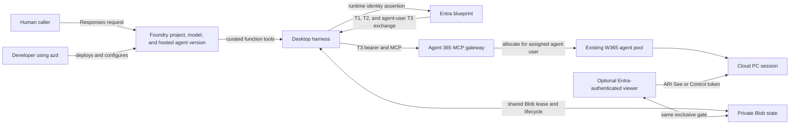

# Computer use with Foundry and Windows 365

A C#/.NET sample in which a **Foundry hosted agent calls Windows 365 tools
directly** through Agent 365's MCP gateway. Agent Framework handles model/tool
iteration. There is no secondary computer-use model, native `computer` tool,
or custom screenshot/action planning loop.

The suggested model is **`gpt.6.astra`**. Set `AZURE_AI_MODEL_DEPLOYMENT_NAME` to
your actual Foundry deployment name. Availability is subscription/region
dependent; the sample does not provision an unverified model SKU. The deployment
must support function calling and image inputs.

> Preview sample, not a production service. W365 onboarding, licenses and paid
> capacity are required. Review [security](SECURITY.md) before using real data.
> [Live acceptance](docs/DEPLOYMENT.md#live-acceptance) is required before publication.

## What this sample demonstrates

| Component | Purpose |
| --- | --- |
| Hosted Responses agent | One model discovers allowed W365 schemas and selects desktop/browser/accessibility actions. |
| Desktop harness | Exclusive ownership, readiness polling, cleanup, action/image/time limits and human pause/resume. |
| Companion viewer | Bootstrap locally or on ACA; enabled, Entra-authenticated ACA viewer provides opaque live-view and take-control links. |
| W365 setup | Reuse Foundry's blueprint/agent identity; reconcile consent, inheritance, agent user and existing pool assignment. |
| Deployment | Foundry `azure.yaml`, non-root Docker image, ACA viewer Bicep and deployment guide. |
| Offline tests | Fake MCP/token handlers, ownership, handoff, ambiguous failures and screenshot conversion. |

### Example scenario

An operator asks the Foundry agent to process an invoice on an assigned Windows
365 Cloud PC. The agent acquires a desktop from the pool already assigned to
its agent user, opens the invoice in Edge, reads the visible fields, writes a
plain-text summary in Notepad, saves it under Documents, verifies the result,
and releases the desktop. The prompt supplies only the business task; the
configured agent-user assignment determines the W365 pool. The bounded demo
prompt is available at
[`samples\prompts\invoice-processing.txt`](samples/prompts/invoice-processing.txt).

Invoke it from PowerShell with a fresh agent session:

```powershell
$prompt = Get-Content .\samples\prompts\invoice-processing.txt -Raw
$version = azd env get-value AGENT_WIN365_DESKTOP_AGENT_VERSION
azd ai agent invoke win365-desktop-agent --version $version --new-session $prompt
```

Add `--user-identity "<allowed-user-id>"` when the deployed endpoint requires
the configured caller identity header.

This sample supports **one operator and one fresh task at a time**. Each task
releases its Cloud PC; subsequent requests do not inherit desktop or image
history. `previous_response_id`, `conversation` and background execution are
rejected. This trades multi-turn desktop continuity for explicit ownership and
bounded screenshot payloads.

## How it works



`azd` participates in deployment, not runtime authentication. Foundry creates
the blueprint and agent identity with the first hosted version. Tenant setup
then creates or reuses a child **agent user**, assigns that user to an existing
W365 pool, and optionally authorizes an exact hosted-runtime or viewer identity
to federate with the blueprint. The human caller, Foundry caller partition,
agent identity, agent user, pool, and allocated desktop session are distinct.

At runtime the application must turn the hosted agent identity assertion into
blueprint T1, agent T2, and resource-scoped agent-user T3. T3 is the only token
sent to W365. This custom exchange is needed because Foundry Responses hosting
does not natively provide a ready W365 agent-user token. If any identity or
token-exchange requirement is unavailable, the application fails closed before
calling W365 or allocating a Cloud PC.

See [architecture](docs/ARCHITECTURE.md) for the provisioning and runtime
sequence diagrams and [authentication](docs/AUTHENTICATION.md) for token
boundaries.

## Prerequisites

What the sample needs depends on whether you are validating it offline on
Windows or deploying it to Foundry and Windows 365.

- **Offline validation:** Windows, [.NET 10 SDK](https://dotnet.microsoft.com/download/dotnet/10.0), [PowerShell 7.4+](https://learn.microsoft.com/powershell/scripting/install/installing-powershell), and Git.
- **Live deployment:** an Azure subscription and tenant onboarded for Foundry and Windows 365, plus Azure CLI, Azure Developer CLI with the required Foundry extensions, PowerShell 7.4+, and .NET 10. Viewer deployment additionally requires the Azure CLI `containerapp show`, `containerapp update`, and `containerapp registry set` commands. The pre-provision hook verifies them before changing Azure resources.
- **Windows 365 readiness:** an existing W365 agent pool with licensing, billing, image, and capacity ready, or a reviewed `config\deployment.local.json` profile that the stitched `azd up` flow can use to create one.
- **Foundry path:** either create a fresh environment that provisions a dedicated Foundry account, project, and model deployment, or reuse an existing Foundry project that already has a deployed model supporting function calling and image inputs.
- **Roles:** if you reuse an existing Foundry project, you need `Foundry Project Manager` access to that project and the delegated setup permissions listed in [W365 setup](docs/W365-SETUP.md#setup-permissions-delegated-not-runtime).

## Guides

| Goal | Guide |
| --- | --- |
| Verify the sample locally on Windows | [Windows quickstart](#option-1-windows-quickstart-no-azure-required) |
| Initialize and deploy the Foundry hosted agent | [Deployment](docs/DEPLOYMENT.md) |
| Bind the deployed Foundry identities to W365 | [W365 setup](docs/W365-SETUP.md) |
| Deploy live view and human handoff | [Viewer](docs/VIEWER.md) |
| Understand identity and token boundaries | [Authentication](docs/AUTHENTICATION.md) |
| Understand ownership, state, and recovery | [Architecture](docs/ARCHITECTURE.md) |
| Review operational and computer-use risks | [Security](SECURITY.md) |
| Contribute and run validations | [Contributing](CONTRIBUTING.md) |

The C# application is organized as a single modular monolith with feature
folders and mirrored tests; see the
[source layout](docs/ARCHITECTURE.md#source-layout).

## Option 1: Windows quickstart (no Azure required)

This path verifies the complete offline sample without contacting Foundry,
Microsoft Graph, a model, or a Cloud PC.

Visual Studio is optional. IDE builds require a version compatible with the
.NET 10 SDK. The PowerShell quickstart uses the installed `dotnet` CLI directly
and does not depend on an IDE's bundled MSBuild. The checked-in `global.json`
keeps command-line builds on the .NET 10 SDK family while allowing compatible
feature bands and patches.

From PowerShell 7 at the repository root:

```powershell
pwsh -NoProfile -File .\scripts\Setup-Local.ps1
pwsh -NoProfile -File .\scripts\Start-Local.ps1
```

The setup command creates `.env` only when it is missing, verifies the required
safe local settings, restores packages, builds a Release binary, and runs all
offline tests. The start command launches that prebuilt binary without another
restore/build, waits for both health endpoints, writes logs under `.local\`,
and stops both processes when you press `Ctrl+C`.

Expected URLs:

| Endpoint | Expected result |
| --- | --- |
| `http://localhost:8088/health` | Agent bootstrap is healthy. |
| `http://localhost:5050/health` | Viewer bootstrap is healthy. |
| Any desktop or Responses route | HTTP 503 until live W365 phase 2 is configured. |

Local mode is unauthenticated and loopback-only. Do not publish or tunnel these
ports. To rebuild without running tests, use
`.\scripts\Setup-Local.ps1 -SkipTests`.

## Option 2: Azure Developer CLI (`azd`)

This path publishes the Foundry hosted agent and then binds the Foundry-owned
identity chain to Windows 365. The repository already contains `azure.yaml`; do
not run `azd init` or `azd ai agent init` inside the clone.

### Authenticate and validate tooling

```powershell
az login
az account set --subscription "<subscription-id>"
azd auth login
pwsh -NoProfile -File .\tests\PowerShell\Test-AzdPrerequisites.ps1 -RequireLogin
azd ai agent doctor --local-only
```

Use the same tenant and subscription for `az` and `azd`. Review the validation
output before making resource changes.

### Fresh environment path

For a fresh environment, do not set existing-project identifiers up front. If
you want azd to create a dedicated Foundry project and perform the W365-enabled
deployment flow, initialize the local environment values and then run one
`azd up`:

```powershell
pwsh -NoProfile -File .\scripts\Initialize-Greenfield.ps1 `
    -SubscriptionId "<subscription-id>" `
    -Prefix "<resource-prefix>" `
    -Environment "dev" `
    -EnableW365
azd up
```

Review the tenant-specific W365 billing plan, image, region, and capacity in
the ignored `config\deployment.local.json` first. The hook requests explicit
approval before creating or updating billable W365 resources. The agent-user
UPN uses the tenant's verified default user-creation domain, including custom
domains. Use `-AgentUserPrincipalName` or `-AgentUserDomain` only when an
explicit override is required.

If you want only the phase-1 bootstrap first, omit `-EnableW365`, then use the
staged deployment flow in [deployment](docs/DEPLOYMENT.md).

### Existing Foundry project path

Only use the following `azd env set` values when you are binding this sample to
an already existing Foundry project. They are not part of the initial fresh
environment setup.

```powershell
azd env new <environment-name>
azd env set FOUNDRY_PROJECT_ENDPOINT "<existing-foundry-project-endpoint>"
azd env set FOUNDRY_PROJECT_OWNERSHIP "existing"
azd env set AZURE_AI_ACCOUNT_NAME "<existing-foundry-account-name>"
azd env set AZURE_AI_PROJECT_NAME "<existing-foundry-project-name>"
azd env set AZURE_AI_PROJECT_ID "<existing-foundry-project-resource-id>"
azd env set AZD_FOUNDRY_RESOURCE_GROUP_ID "<existing-foundry-resource-group-id>"
azd env set AZURE_FOUNDRY_RESOURCE_GROUP "<existing-foundry-resource-group-name>"
azd env set AZURE_AI_MODEL_DEPLOYMENT_NAME "<existing-model-deployment-name>"
pwsh -NoProfile -File .\scripts\Invoke-AzdDeployment.ps1 -Mode Validate
```

### Deploy the Foundry bootstrap

```powershell
pwsh -NoProfile -File .\scripts\Invoke-AzdDeployment.ps1 `
    -Environment "<resource-prefix>-dev" `
    -Mode DeployAgent `
    -ConfirmResourceChanges
```

This deploys the agent with `W365_ENABLED=false`. A healthy agent returns a
phase-2 configuration response instead of attempting desktop access. See
[phase 1](docs/DEPLOYMENT.md#phase-1-deploy-bootstrap) for verification.

### Bind Foundry identity to W365

1. Run the read-only [identity discovery](docs/DEPLOYMENT.md#discover-the-foundry-identity) for the exact deployed agent version.
2. Run [W365 setup](docs/W365-SETUP.md) with the discovered blueprint and agent IDs, an agent-user UPN, and either an existing W365 pool ID or the values needed to create the pool.
3. Confirm the script persisted the emitted `W365_*` values into the selected azd environment. They are identifiers, not credentials.

Setup validates the existing identity chain, reconciles approved permissions,
creates or reuses the agent user, creates or updates the pool when requested,
and assigns the agent user to that pool. It does not create a replacement
Foundry identity.

If you want a single stitched command after bootstrap, use:

```powershell
pwsh -NoProfile -File .\scripts\Invoke-W365SetupFlow.ps1 `
     -Environment "<azd-environment-name>" `
     -AgentUserPrincipalName "foundry-w365-agent@YOUR-TENANT.onmicrosoft.com" `
     -PoolIdOrUrl "https://intune.microsoft.com/#view/Microsoft_Azure_CloudPC/CloudPCAgentPoolDetail.ReactView/poolId/<pool-guid>" `
     -BillingConfirmed `
     -ConfirmResourceChanges `
     -UseDeviceCode
```

### Enable desktop access and verify

Configure the remaining private Blob session state, allowed operator,
and approved blueprint credential mode, then redeploy the same agent name:

```powershell
azd ai agent doctor
pwsh -NoProfile -File .\scripts\Invoke-AzdDeployment.ps1 `
    -Environment "<resource-prefix>-dev" `
    -Mode DeployAgent `
    -ConfirmResourceChanges
```

Then run the bounded checks in [live acceptance](docs/DEPLOYMENT.md#live-acceptance)
before allowing real tasks. Confirm identity continuity, token scopes, pool
readiness, session cleanup, and fail-closed behavior.

The optional [viewer](docs/VIEWER.md) adds authenticated live view and human
handoff. It is not required for direct W365 MCP execution.

## Troubleshooting

| Error | Fix |
| --- | --- |
| `pwsh` is not recognized | Install PowerShell 7.4+, then open a new terminal. Windows PowerShell 5.1 is not supported. |
| The .NET 10 SDK is required | Install the SDK, not only the runtime, then open a new terminal. |
| `MSB4236`, `NETSDK1209`, or the IDE says `Microsoft.NET.Sdk(.Web)` is unavailable | The SDK may be installed while the IDE's bundled MSBuild is incompatible. Run `pwsh -NoProfile -File .\scripts\Setup-Local.ps1` with the standalone SDK, or upgrade the IDE to a .NET 10-compatible version. |
| The azd check reports version `1.20.0` after upgrading | `1.20.0` cannot parse this Foundry project, and the current agent/project extensions require `azd 1.32.0+`. Windows may have an older machine-wide `azd` before the current user installation on `PATH`. The check uses the newest compatible installation and prints the exact `$env:Path` command to run before direct `azd` commands. |
| Required Azure CLI Container Apps command is unavailable | Upgrade Azure CLI first. If the command group is still unavailable, run `az extension add --name containerapp --upgrade`. The `preprovision` hook checks the exact commands before Azure resources are changed whenever `DEPLOY_VIEWER=true`. |
| `Skipped: Didn't find new changes` appears without a component name | This is azd's incremental package/provision cache output, not an error. It means that particular input had no detected change. The sample's `preup` message explains this, and the following deployment-plan table gives labeled create/reuse/skip decisions. |
| `NU1101` and only `library-packs` is listed | Pull the latest `NuGet.Config`; it clears inherited disabled feeds. |
| `NU1301` or TLS handshake failure for `nuget.org` | The checked-in configuration also uses Microsoft's package-feed proxy for managed Windows environments. Verify your corporate proxy permits it. |
| Port 5050 or 8088 is already in use | Stop the owning process, or run `.\scripts\Start-Local.ps1 -AgentPort 18088 -ViewerPort 15050`. |
| `azd init` or `azd ai agent init` fails inside this clone | This repository already contains `azure.yaml`. Stay in the clone and use `azd env new` or `Initialize-Greenfield.ps1` instead. |
| W365 setup prompts for a device code and then times out | Rerun with `-UseDeviceCode`, complete the prompt as soon as the code appears, and increase `-DeviceCodeMaxAttempts` only if your sign-in flow routinely misses the first prompt. |
| You are reusing a Foundry project and validation fails before deployment | Confirm the environment contains the full existing-project identifiers and that your operator identity has `Foundry Project Manager` on that project. |

## Deploy and develop

Follow [deployment](docs/DEPLOYMENT.md) for the Foundry agent, shared Blob state
and ACA viewer. Key Vault is used **only for the viewer OIDC secret**, not a
blueprint credential. Agent and viewer are separate processes built from the
same project; the viewer runs with `--viewer`. Never enable local mode in Azure.
See [viewer setup](docs/VIEWER.md) for its separate OIDC web application.

Use the same Windows validation command as the quickstart:

```powershell
pwsh -NoProfile -File .\scripts\Setup-Local.ps1
```

For infrastructure changes, additionally validate the viewer template:

```powershell
az bicep build --file .\infra\viewer.bicep --stdout
```

Tests do not contact a Cloud PC or model. NuGet dependencies are pinned in project
files; upgrade the preview hosting packages as a compatible set.

## Next steps

- Follow [deployment](docs/DEPLOYMENT.md) for the staged bootstrap, rollback, teardown, and live-acceptance details.
- Follow [W365 setup](docs/W365-SETUP.md) when you need delegated Graph permissions, pool template capture, or viewer federation.
- Follow [viewer setup](docs/VIEWER.md) only if you need authenticated live view or human handoff.

## References

- [W365 getting started](https://github.com/microsoft/windows-365-for-agents/blob/main/docs/getting-started.md)
- [W365 authentication](https://github.com/microsoft/windows-365-for-agents/blob/main/docs/authentication.md)
- [W365 MCP API](https://github.com/microsoft/windows-365-for-agents/blob/main/docs/api-reference.md)
- [W365 screen sharing](https://github.com/microsoft/windows-365-for-agents/blob/main/docs/screen-sharing.md)
- [Foundry C# hosted sample](https://github.com/microsoft-foundry/foundry-samples/tree/main/samples/csharp/hosted-agents/agent-framework/hello-world)
- [Foundry agent identity](https://learn.microsoft.com/azure/foundry/agents/concepts/agent-identity)
- [Public blueprint token helper (activity/autopilot reference)](https://github.com/microsoft-foundry/foundry-samples/blob/main/samples/csharp/foundry-autopilot-agent/src/hello_world_a365_agent/Services/AgentTokenHelper.cs)
- [Foundry Python onboarding reference](https://github.com/microsoft-foundry/foundry-samples/tree/main/samples/python/hosted-agents/agent-framework/responses/01-basic)
- [OpenAI native computer tool](https://developers.openai.com/api/docs/guides/tools-computer-use#use-the-computer-tool): an alternative architecture, **not** this sample's tool protocol.

See [contributing](CONTRIBUTING.md), [security](SECURITY.md), and [license](LICENSE).
