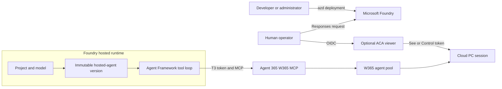

# Architecture and code map

This document describes the durable component, identity, state, lifecycle, and
recovery design. Deployment commands belong in
[Deployment](DEPLOYMENT.md), identity protocol details in
[Authentication](AUTHENTICATION.md), and tenant setup in
[Windows 365 setup](W365-SETUP.md).

## Scenario at a glance

Microsoft Foundry hosts the Responses agent, model, and function-tool loop.
Windows 365 supplies a Cloud PC through Agent 365 MCP. The optional ACA viewer
provides authenticated observation and human control without hosting the model
or Responses endpoint.



`azd` is a deployment orchestrator, not part of the runtime request or token
path. The human operator is authorized separately from the Entra agent user
assigned to W365 capacity.

The sample supports one active desktop owner and one fresh task at a time.

## Names that must not be confused

| Name | Authority and use |
| --- | --- |
| Foundry agent name | Stable service name. Redeployment creates a new immutable version under this name. |
| Foundry agent version | Exact code and configuration revision used by a hosted session. |
| `W365_BLUEPRINT_ID` | Blueprint app/client ID and consent/trust boundary. |
| `W365_AGENT_OBJECT_ID` | Agent object/principal ID used for Graph parent validation, Azure RBAC, and optional federation. |
| `W365_AGENT_ID` | Agent app/client ID used in the W365 token exchanges. |
| `W365_AGENT_USER_ID` | Agent-user object ID assigned directly to the W365 pool. It is not a credential. |
| `x-agent-user-id` | Foundry-injected opaque caller partition used to authorize one hosted caller. |
| Human operator IDs | Entra tenant/object claims used for viewer authorization and durable task ownership. |
| W365 pool ID | Capacity pool from which W365 allocates a desktop session. |
| W365 session ID | One remote desktop allocation. It is supplied by W365 and never accepted from the model. |
| Task ID | Server-generated owner of one bounded request and desktop lifecycle. |
| Viewer link ID | Random lookup identifier for the companion viewer. It is not a W365 session ID. |

App/client IDs and object/principal IDs are different types even when a service
currently returns the same GUID for both.

## Provisioning and binding flow

The two-phase deployment preserves Foundry-owned identities:

1. Deploy the Foundry project, model, and `W365_ENABLED=false` hosted agent.
2. Foundry creates the blueprint and agent identity.
3. Discover the exact active agent version's blueprint client ID and agent
   object/principal ID.
4. Provision private Blob state and grant the exact agent principal access.
5. Optionally provision the viewer bootstrap after state validation.
6. Validate the existing Entra parent chain and reconcile approved W365 grants,
   inheritance, agent user, and pool assignment.
7. Persist non-secret identifiers and ownership manifests.
8. Deploy the same agent name with W365 enabled.
9. Activate the viewer and publish another immutable agent version only when
   its OIDC and screen-share prerequisites are complete.

No phase creates a replacement blueprint or agent identity. New agent versions
must be rediscovered and compared with the accepted binding before tasks are
allowed.

The main control-plane entry points are:

- [`azure.yaml`](../azure.yaml)
- [`Complete-AzdUp.ps1`](../scripts/Complete-AzdUp.ps1)
- [`Get-FoundryIdentity.ps1`](../scripts/Get-FoundryIdentity.ps1)
- [`Invoke-W365SetupFlow.ps1`](../scripts/Invoke-W365SetupFlow.ps1)
- [`Setup-W365.ps1`](../scripts/Setup-W365.ps1)

### Deployment completion and viewer redeployment state

`Complete-AzdUp.ps1` owns the durable post-deployment handshake in the selected
`.azure\<environment>\.env` file. Before viewer bootstrap or live activation
can mutate runtime configuration, it writes
`W365_AGENT_REDEPLOY_CHECK_PENDING=true` with the prior viewer URL and live
state. After the mutation it compares the persisted baseline:

- no change clears only the comparison marker;
- a change sets `W365_AGENT_REDEPLOY_PENDING=true`; and
- only a successful guarded hosted-agent deployment clears the redeployment
  marker.

Failures or process termination preserve the comparison or redeployment state
for the next run. A same-environment `azd up` retry reconciles that state. When
the optional `Invoke-AzdUp.ps1` wrapper is used, it additionally requires both
pending markers to be false before persisting wrapper completion or printing
success. Operators must not edit these markers manually.

## Request path

Bootstrap starts before model initialization. With `W365_ENABLED=false`, the
agent exposes healthy readiness and a phase-two-required Responses 503 without
accessing W365, model, or state credentials. Viewer bootstrap exposes `/health`
and returns 503 for live routes.

When enabled, the hosted application registers Foundry Responses and exposes a
small function surface:

| Function | Harness responsibility |
| --- | --- |
| `open_desktop` | Initialize MCP, acquire the shared slot, persist ownership and idempotency state, allocate once, wait for readiness, reconnect MCP, refresh the live catalog, and return opaque viewer links when enabled. |
| `list_desktop_tools` | Return only policy-allowed tools currently advertised by W365, with their live schemas. |
| `desktop_action` | Validate ownership, tool name, arguments, pause state, and budgets; persist operation-in-flight state; call W365 once; return bounded observations. |
| `request_human_control` | Wait for the action lock, persist Paused, and return the authenticated control link. |
| `wait_for_human` | Wait for explicit viewer resume without issuing W365 actions. |
| `close_desktop` | Call the advertised end-session tool and clear durable state only after the result is accepted. |

The generic action wrapper preserves live W365 tool names and schemas rather
than inventing a parallel computer-use API. Harness code supplies lifecycle
session identifiers; the model cannot provide or replace them.

The static allowlist and live catalog must both contain a tool before it can be
invoked. Shell, Python, and browser JavaScript-evaluation tools are excluded.
This does not make the desktop a security sandbox: ordinary mouse and keyboard
input can still reach powerful applications.

Each request has a 15-minute internal task deadline. Tool calls link that
deadline with client cancellation, while the HTTP client-abort token remains
independent so the framework can still write a final response. A tool timeout
becomes a typed result when possible; an uncaught internal deadline becomes a
504 only while the client connection is still open.

## Session ownership and lifetime

Live agent and viewer processes share one private Blob slot. The record contains:

- server-generated task and viewer lookup IDs;
- human owner tenant/object IDs;
- W365 session metadata and screen-share link;
- deadline and lifecycle phase; and
- operation-in-flight state.

It contains sensitive session metadata but no OAuth tokens. `FileSessionStore`
is an offline-test helper only.

The Blob lease and state lock cover:

1. ownership validation;
2. operation-in-flight persistence;
3. the remote W365 mutation; and
4. result persistence.

The viewer uses the same lock for pause, token issuance, and resume. A control
token therefore cannot be minted between an action's ownership check and its
execution.

Each request receives a fresh task ID. Another request cannot adopt its
desktop, even for the same operator. After close, that task cannot allocate a
replacement session.

Normal cleanup runs on explicit close and in request `finally`, using an
independent bounded cleanup timeout. The runtime always attempts `EndSession`
when a W365 session ID is known.

The system does not claim exactly-once remote effects. If a process fails after
a request leaves the service, the remote outcome may be unknown. The slot stays
blocked instead of replaying the action or allocating another desktop.

Environment teardown is separate from request cleanup. Setup writes ownership
manifests under `.azure\<environment>\`; `Invoke-AzdDown.ps1` consumes them
once, removes the Azure layers in reverse dependency order, and verifies that
no environment-tagged resource group remains.

## Identity ownership

The runtime selects the credential mode; the model and request cannot. The
platform-injected blueprint client ID must match `W365_BLUEPRINT_ID`.

All modes obtain blueprint T1 and then share the T1 → T2 → agent-user T3 flow.
Only T3 is sent to Agent 365/W365. No W365 path falls back to Azure CLI,
developer credentials, or an interactive user.

Hosted-runtime and viewer FICs are explicit blueprint trusts and can affect
sibling agents. Their subjects must be the discovered agent object ID and the
viewer UAMI object ID respectively. See [Authentication](AUTHENTICATION.md) for
credential delivery, scopes, and trust boundaries.

Setup records which Entra and W365 objects were created or reused plus the
blueprint's prior state. Cleanup removes only recorded sample-owned entries,
restores reused grants to their prior scopes, and blocks shared-project cleanup
without explicit approval.

Setup and Key Vault bootstrap treat each remote control-plane change as a
durable operation. The ownership manifest is atomically updated with a
`pending` intent before the request is sent, then updated immediately with the
confirmed object ID, created/reused disposition, and any restoration baseline.
If the provider committed a request but the local process stopped before that
confirmation was written, the next run compares the pending target with remote
state and preserves the original `created` disposition rather than adopting it
as reused. Mismatched or ambiguous pending state fails closed. Operators must
retry with the same environment and inputs; teardown continues to act only on
confirmed manifest ownership.

## Fail-closed recovery

A Blob transaction uses an infinite lease so a crashed worker cannot allow
another worker to execute concurrently with an operation of unknown status.
Runtime lease acquisition waits for at most ten seconds. Continued lease
conflict becomes `desktop_state_locked` with an instruction not to retry
automatically.

Before recovery:

- stop every active hosted session for the selected environment;
- use the exact azd environment that owns the Blob;
- ensure the selected credential mode can access W365 and the state Blob; and
- run read-only inspection before approving mutation.

Read-only inspection:

```powershell
pwsh -NoProfile -File .\scripts\Recover-StaleDesktopState.ps1 `
    -Environment "<azd-environment-name>"
```

The wrapper reads `FOUNDRY_AGENT_NAME` and the active binding from the selected
environment. It checks every hosted session for that agent across immutable
versions and accepts only non-executing `idle`, `stopped`, `deleted`, or
`expired` records. Running, provisioning, unknown, or paged results fail
closed.

A non-null desktop record must:

- be expired;
- have `OperationInFlight=false`;
- contain a remote W365 session ID;
- match the configured operator tenant/object IDs; and
- remain unchanged throughout inspection.

The recovery service invokes only the live catalog's session-details tool and
accepts W365 absence only when the response contains exactly:

```text
No W365 session found. Call mcp_W365ComputerUse_StartSession first.
```

Substrings, multiple content items, contradictory content, unexpected errors,
or a missing advertised tool fail without changing state.

Expected read-only outcomes:

```text
Inspection passed: state is stale and W365 reports no remote session. No changes were made.
```

or, when no state or lease needs repair:

```text
Inspection passed: no persisted desktop state or lease requires recovery.
```

After reviewing the evidence, approve mutation:

```powershell
pwsh -NoProfile -File .\scripts\Recover-StaleDesktopState.ps1 `
    -Environment "<azd-environment-name>" `
    -Apply
```

`-Apply` repeats every check, breaks the verified stale lease at most once,
acquires its own infinite lease, re-reads the Blob, verifies the ETag and full
serialized record are unchanged, writes JSON `null` once, and releases the
lease.

Expected completion:

```text
Recovery completed: stale state was cleared and the recovery lease was released.
```

Acquire, upload, or release ambiguity is reported by stage. Do not repeat
`-Apply`; rerun read-only inspection and obtain fresh approval. Expiry alone is
never evidence that the remote W365 session ended.

## Bounded observations

The runtime enforces these limits:

| Boundary | Limit |
| --- | --- |
| Whole task | 15 minutes |
| Desktop action calls | 60 |
| Screenshots | 8 per task |
| Screenshot dimensions | Maximum 1280 pixels on the longest edge |
| Encoded screenshot size | Maximum 128 KiB |
| Text observation | Maximum 16,000 characters |
| MCP response | Maximum 4 MiB |

Screenshots are returned as multimodal image content, resized to JPEG when
required, and include original/resized dimensions for coordinate mapping.
Oversize observations fail explicitly. Prefer accessibility observations when
the live tool catalog provides them.

Action POSTs are never automatically retried. MCP supports the bounded JSON/SSE
response forms required by the sample but does not implement general streaming
subscription or resumption.

Fresh tasks use fresh Agent Framework sessions; model history is not persisted
across requests.

## Source layout

The hosted agent and ACA viewer are separate executables. Both reference
`Win365Shared`; neither executable references the other.

| Project/folder | Responsibility |
| --- | --- |
| `src\Win365Shared\Configuration` | Strict environment parsing and shared startup validation. |
| `src\Win365Shared\Identity` | Explicit blueprint credential modes and agent-user token exchanges. |
| `src\Win365Shared\State` | Session contract, Blob-backed live state, and file-backed offline test state. |
| `src\Win365Agent\Hosting` | Foundry composition, bootstrap endpoints, tool registration, caller authorization, and request cleanup. |
| `src\Win365Agent\Desktop` | Desktop lifecycle, ownership, budgets, pause/resume, and allowlist policy. |
| `src\Win365Agent\Mcp` | MCP handshake, live catalog, calls, and bounded observation conversion. |
| `src\Win365Agent\Responses` | Fresh-request/session behavior and Responses validation. |
| `src\Win365Viewer` | Independent ACA entry point, OIDC authorization, CSRF/CSP, token endpoints, and static assets. |

Each production project has a corresponding test project under `tests\` with
mirrored feature folders.

| Script | Responsibility |
| --- | --- |
| `scripts\Complete-AzdUp.ps1` | Orchestrates guarded phase-two setup after the initial azd deployment. |
| `scripts\Get-FoundryIdentity.ps1` | Reads the exact deployed version's blueprint and agent IDs. |
| `scripts\Invoke-W365SetupFlow.ps1` | Validates phase-two prerequisites, runs tenant setup, persists ownership, and redeploys the agent. |
| `scripts\Setup-W365.ps1` | Reconciles the existing blueprint, agent user, grants, inheritance, pool, and assignment. |
| `scripts\Invoke-AzdDeployment.ps1` | Validates, provisions, packages, deploys, and verifies the hosted agent. |
| `scripts\Invoke-AzdDown.ps1` | Runs ownership cleanup once and removes layered Azure infrastructure. |
| `scripts\Recover-StaleDesktopState.ps1` | Performs read-only stale-state inspection and separately approved repair. |
