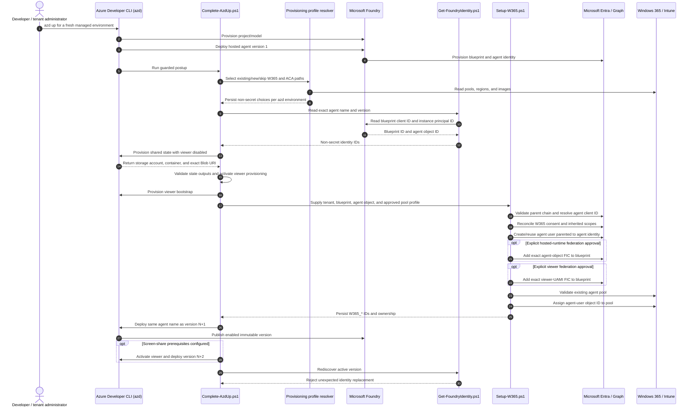
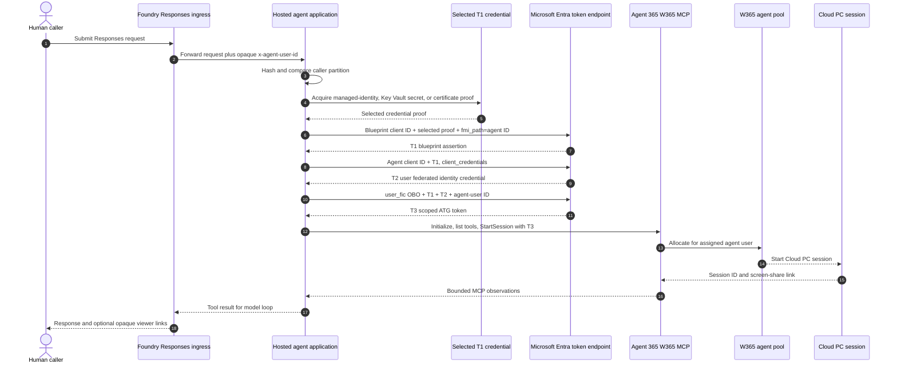

# Architecture and code map

## Scenario at a glance

This sample fills a gap between two platforms. Microsoft Foundry hosts the
Responses agent, model, and function-tool loop. Windows 365 supplies a Cloud PC
through Agent 365's MCP endpoint. Foundry does not hand the application a ready
W365 agent-user token, so this repository provisions the Entra relationships and
implements the runtime token exchanges that join the two systems.

`azd` is the deployment orchestrator. It deploys immutable versions of the same
Foundry agent and supplies configuration, but it is not in the runtime request or
token path. Likewise, the human who invokes Foundry is not impersonated as the
W365 agent user. The human is authorized separately; the Entra agent user is the
non-human identity assigned to paid W365 pool capacity.

```mermaid
flowchart LR
   developer[Developer or administrator] -->|deploys with azd| foundry[Microsoft Foundry]
   human[Human operator] -->|Responses request| foundry

   subgraph foundrySide[Foundry control and runtime]
      project[Foundry project and model]
      version[Hosted agent version]
      framework[Agent Framework tool loop]
      project --> version --> framework
   end

   foundry --> project
   framework -->|custom token provider| entra[Microsoft Entra ID]

   subgraph identity[Entra agent identity chain]
      blueprint[Agent identity blueprint]
      agentId[Agent identity]
      agentUser[Agent user]
      blueprint -->|parent| agentId -->|parent| agentUser
   end

   entra --> identity
   agentUser -->|assigned once| pool[W365 agent pool]
   framework -->|agent-user ATG token and MCP| gateway[Agent 365 MCP gateway]
   gateway -->|allocate session from pool| pool
   pool --> cloudPc[Cloud PC session]

   viewer[Optional authenticated viewer] -->|See or Control token| cloudPc
   human -->|Entra OIDC| viewer
```



The **hosted agent** is versioned by Foundry. Redeploying the same agent name
creates a new immutable version. The **W365 pool is not versioned by this
sample**: it is an existing capacity pool, and setup assigns one agent user to
it. At runtime, W365 allocates a session/Cloud PC from that pool.

## Names that must not be confused

| Name | Created or supplied by | Used for |
| --- | --- | --- |
| Foundry agent version | Foundry deployment through `azd` | Immutable code/configuration revision under the same agent name. |
| Blueprint app/client ID (`W365_BLUEPRINT_ID`) | Foundry phase 1; read by `Get-FoundryIdentity.ps1` | Parent trust and consent boundary for one or more agent identities. |
| Agent object/principal ID (`W365_AGENT_OBJECT_ID`) | Foundry phase 1 | Graph parent validation, Azure RBAC, and hosted-runtime FIC subject. |
| Agent app/client ID (`W365_AGENT_ID`) | Resolved by `Setup-W365.ps1` from the agent object | Managed-identity selection, `fmi_path`, and T2/T3 token requests. |
| Agent-user object ID (`W365_AGENT_USER_ID`) | Created or reused by `Setup-W365.ps1` | `user_id` in the final exchange and direct assignment to the W365 pool. It is not a secret. |
| Hosted caller partition (`x-agent-user-id`) | Foundry ingress | Binds one allowed Foundry caller. It is not the operator object ID or agent-user ID. |
| Human operator IDs | Entra tenant and object claims | Authorize the optional viewer and identify the session owner. |
| W365 pool ID | Existing W365/Intune configuration | Paid Cloud PC capacity to which the agent user is assigned. |
| W365 session ID | W365 at runtime | One allocated desktop session; never accepted from the model. |

The agent app/client ID and object/principal ID are different identifier types.
For the currently validated Foundry agent identity, Microsoft Graph returns the
same GUID value in both fields. Setup still resolves and emits each field
independently because their API roles are different and equality is not a
portable assumption.

## Provisioning and binding flow

The two-phase lifecycle avoids manufacturing replacement identities. Phase 1
lets Foundry create its supported blueprint and agent identity. Only after their
exact IDs are discovered does an administrator authorize W365 relationships.
For a fresh managed environment, one `azd up` orchestrates both phases; staged
scripts expose the same boundaries as separate commands.



Relevant implementation: [`azure.yaml`](../azure.yaml),
[`Resolve-AzdUpProvisioningProfile.ps1`](../scripts/Resolve-AzdUpProvisioningProfile.ps1),
[`Get-FoundryIdentity.ps1`](../scripts/Get-FoundryIdentity.ps1), and
[`Setup-W365.ps1`](../scripts/Setup-W365.ps1).

## Request path

`W365_ENABLED` starts as `false` and is strictly `true`/`false`. Bootstrap
serves Foundry Responses with a phase-2-required 503 and healthy readiness,
starting before any model initialization and without accessing W365, model or
state credentials. For a fresh managed environment, `postup` enables W365 only
after state, credential, operator, and W365 setup checks complete. The dedicated
`Win365Viewer` executable owns viewer bootstrap and live routes.
Viewer bootstrap has `/health` and viewer-specific 503 routes, requiring no
OIDC configuration. The hosted agent receives the viewer hostname separately
but advertises links only after `VIEWER_LIVE_ENABLED=true`. Local mode is
loopback-only bootstrap/offline; enabled local desktop execution is refused.

After phase 2 enables W365, the hosting composition creates an
`AIProjectClient.AsAIAgent` with ordinary function tools and registers the
public hosting SDK's `AddFoundryResponses` / `MapFoundryResponses` ASP.NET Core
integration. `Program.cs` remains a small composition root. The model calls:

| Function | Harness behavior |
| --- | --- |
| `open_desktop` | Initialize MCP, lock the shared slot, allocate once, persist identity, poll Ready, rediscover tools, return opaque viewer links. |
| `list_desktop_tools` | Return only allowlisted tool names and their live schemas. |
| `desktop_action` | Validate tool/arguments/ownership, wait if paused, persist in-flight marker, call W365 once, return text/image observations. |
| `request_human_control` | Persist Paused and return control link. |
| `wait_for_human` | Await explicit viewer resume without issuing W365 actions. |
| `close_desktop` | End W365 session and clear the durable slot only after acceptance. |

The generic `desktop_action` wrapper preserves W365's actual tool names and input
shapes rather than maintaining guessed hand-written schemas. It is still a
direct W365 function-tool agent, not a nested computer-use planner.
`AllowedTools` is a static allowlist; the live catalog must also contain the name.
Session lifecycle identifiers are supplied by the harness, never the model.
`execute_shell_command`, `execute_python_code` and `browser_eval_js` are excluded.
Pixel input can still launch powerful applications: an allowlist is not a desktop
sandbox or a guarantee that the model follows safety instructions.

`DesktopRequestMiddleware` bounds the whole task (including operator handoff
wait) with a 15-minute internal deadline, but never overwrites
`HttpContext.RequestAborted` with that deadline token. Doing so previously tied
the entire downstream response pipeline — including the final assistant
message write — to the internal budget: once the deadline elapsed, the
framework's own response-writing code observed the same canceled token and the
whole HTTP response died silently (no body, no error, no log line). Instead,
the middleware links the deadline into each desktop tool call individually
(`DesktopRequestContext.LinkDeadline`), while the original client-abort token
stays untouched. When the deadline elapses mid-tool-call, `OpenDesktopAsync`'s
`OperationCanceledException` catch (guarded on the *original* token still being
live) converts it into a normal `w365_dependency_timeout` tool result the model
can see and report; a middleware-level catch is a last-resort fallback that
writes a `504 task_deadline_exceeded` JSON response only if some other
cancellation escapes tool-level handling and the real connection is still open.

## Session ownership and lifetime

Live deployed agent/viewer state uses one slot in a private shared Azure Blob.
`FileSessionStore` is an offline-test helper only; live runtime requires Blob,
with no active local-file backend. The record includes random link ID, task ID, human owner IDs,
W365 session/link, deadline, phase and in-flight marker. It contains sensitive
session metadata, but not OAuth tokens.

The lock covers ownership checks, in-flight persistence, the remote operation and
result persistence. The viewer uses that exact lock for pause/resume/token issuance.
Therefore a control token is not minted between an action's ownership check and
its execution. Each request gets a server-generated task ID; overlapping requests
cannot adopt another task's desktop, even for the same operator.
After closing, the same task cannot allocate a second desktop.

Graph setup IDs, MCP transport-session ID, W365 desktop-session ID, hosted user
partition, task ID and viewer link ID are distinct identifiers.

Normal runtime cleanup runs on explicit close and in request `finally`, with an
independent 75-second cleanup timeout. A task is limited to fifteen minutes. A crash
may prevent EndSession; the system does not claim exactly-once remote effects.
Unknown results remain blocked instead of replaying actions or allocating a
replacement desktop.

Environment teardown is a separate control-plane path. During setup,
`Setup-W365.ps1` writes `.azure/<environment>/w365-ownership.json` with the
sample-owned W365 and Entra objects plus the blueprint's pre-mutation
`requiredResourceAccess`. `Invoke-AzdDown.ps1` consumes that evidence once,
then removes the `viewer`, `state`, and `foundry` layers. It continues only
when a layer deployment is already absent and fails if an environment-tagged
resource group remains. Missing ownership evidence blocks teardown instead of
guessing from names.

## Identity ownership

Phase 1 lets Foundry provision the blueprint and agent identity. Read-only
discovery returns `blueprint.client_id` (blueprint app ID) and
`instance_identity.principal_id` (agent object ID). Phase 2 validates the existing
parents and existing grant/inheritance ambiguity before mutations, resolves the agent app ID, and reconciles W365 grants,
inheritance, agent user and pool assignment without creating separate identities.
Use the same Foundry agent name for new versions and reject unexpected identity
replacement after rediscovery.

The process selects `AgentUserTokenProvider`, not the model.
`W365_BLUEPRINT_CREDENTIAL_MODE` explicitly selects blueprint T1 acquisition;
there is no request-driven selection or automatic fallback. Client-secret mode
is the checked-in default and is live-validated.
Managed-identity federation remains selectable but is blocked in the tested
Foundry host by Entra `AADSTS700231`. Key Vault certificate mode is implemented
and offline-validated but still requires live tenant acceptance. The viewer
supports client-secret or explicitly approved managed-identity federation;
certificate mode is agent-only. Every path shares the T1 -> T2 -> user-FIC T3
flow for ATG/ARI, and no mode falls back to another.

The platform-injected `FOUNDRY_AGENT_BLUEPRINT_CLIENT_ID` is still checked
against `W365_BLUEPRINT_ID` to prevent configuration from crossing blueprint
boundaries, but it is not itself a token. No DAC/CLI fallback or IdentityRM
auxiliary token is used for W365. Model/state access uses ordinary Azure
credentials. See [authentication](AUTHENTICATION.md) for same-tenant
requirements and token boundaries.

### Runtime token and desktop flow



Only T3 leaves the identity layer for W365. T1 and T2 remain in process memory.
[`BlueprintTokenProvider.cs`](../src/Win365Shared/Identity/BlueprintTokenProvider.cs)
implements the managed-identity/FIC step;
[`AgentUserTokenProvider.cs`](../src/Win365Shared/Identity/AgentUserTokenProvider.cs)
implements T2/T3, scope selection, and caching; and
[`McpConnection.cs`](../src/Win365Agent/Mcp/McpConnection.cs) sends T3 to the
W365 MCP endpoint.

Blueprint inherited grants and optional viewer federation may affect sibling
agents. The FIC grants blueprint impersonation, not ARI-only access. Shared
blueprints need explicit administrator approval; the viewer can stay disabled.
The public token helper is an activity/autopilot reference: ordinary Responses
hosting support requires actual live acceptance, with no fallback if unsupported.
This sample neither publishes autopilot nor requires a hiring workflow.

That same shared-boundary concern drives teardown. Cleanup removes only manifest
entries recorded as `created`. Reused permission grants are restored to their
previous scope, reused inheritance entries are left in place, and environments
bound to an existing Foundry project are blocked unless an explicit override is
provided. The goal is minimal-touch rollback on Entra and W365 while still
allowing a dedicated sample environment to be fully torn down in reverse order.

## Integration pain points

| Pain point | Why it exists | Where it is handled |
| --- | --- | --- |
| Foundry does not supply a ready W365 agent-user token | The hosting SDK covers Responses/model execution, while W365 requires the Entra agent-user OAuth chain. | Custom exchanges in [`BlueprintTokenProvider.cs`](../src/Win365Shared/Identity/BlueprintTokenProvider.cs) and [`AgentUserTokenProvider.cs`](../src/Win365Shared/Identity/AgentUserTokenProvider.cs). |
| Phase-1 identity is needed before phase-2 configuration | The blueprint and agent identity do not exist until Foundry deploys an agent version. | Two-phase gate in [`Program.cs`](../src/Win365Agent/Program.cs), deployment declaration in [`azure.yaml`](../azure.yaml), and exact-version discovery in [`Get-FoundryIdentity.ps1`](../scripts/Get-FoundryIdentity.ps1). |
| App IDs, object IDs, users, callers, and sessions are easy to confuse | Entra and Foundry expose several GUIDs with different authority and API roles. Substitution can bind the wrong principal or pool user. | Parent/type checks in [`Setup-W365.ps1`](../scripts/Setup-W365.ps1), startup checks in [`Settings.cs`](../src/Win365Shared/Configuration/Settings.cs), and the terminology table above. |
| Hosted identity cannot automatically impersonate the blueprint | Current Responses hosting exposed the agent instance identity but live validation could not obtain a blueprint assertion directly. | Optional, explicit hosted-runtime FIC in [`Setup-W365.ps1`](../scripts/Setup-W365.ps1). This is broad blueprint trust and needs administrator approval. |
| The final OAuth protocol is preview-sensitive | `client_credentials`, `fmi_path`, and `user_fic` must use exact subjects, scopes, and token roles; the hosting SDK does not abstract this complete path here. | Narrow form construction and allowlisted audiences in [`AgentUserTokenProvider.cs`](../src/Win365Shared/Identity/AgentUserTokenProvider.cs); regression coverage in [`AgentUserTokenProviderTests.cs`](../tests/Win365Shared.Tests/Identity/AgentUserTokenProviderTests.cs). |
| Foundry caller identity is not the W365 agent user | `x-agent-user-id` is an opaque ingress partition; `W365_AGENT_USER_ID` is an Entra agent-user object assigned to a pool. | Caller gate in [`DesktopRequestMiddleware.cs`](../src/Win365Agent/Hosting/DesktopRequestMiddleware.cs); agent-user creation and assignment in [`Setup-W365.ps1`](../scripts/Setup-W365.ps1). |
| W365 setup crosses Entra and Intune control planes | Consent/inheritance and agent-user parentage live in Entra/Graph, while capacity and assignment live in the W365 pool. Pool creation, image, geography, and billing remain manual. | Reconciliation in [`Setup-W365.ps1`](../scripts/Setup-W365.ps1) and administrator prerequisites in [`W365-SETUP.md`](W365-SETUP.md). |
| A remote desktop action cannot be safely replayed after an unknown result | HTTP failure does not prove that StartSession, a click, or EndSession did not occur. | In-flight durable state in [`DesktopRuntime.cs`](../src/Win365Agent/Desktop/DesktopRuntime.cs), exclusive Blob lease in [`BlobSessionStore.cs`](../src/Win365Shared/State/BlobSessionStore.cs), and fail-closed recovery below. |

## Fail-closed recovery

A Blob transaction uses an infinite lease so a process crash cannot allow another
worker to execute concurrently with an operation of unknown status. Runtime lease
acquisition waits for at most ten seconds. Continued `LeaseAlreadyPresent` responses
become the typed, model-visible `desktop_state_locked` error with an instruction not
to retry automatically; caller cancellation remains cancellation. The lease itself
is still infinite and is never replaced by an automatically expiring lock.

This is an intentional availability tradeoff. Use the guarded workflow from the
repository root:

```powershell
# Read-only: verifies that hosted execution is stopped, state is stale, and W365
# reports the exact "No W365 session found" condition.
pwsh -NoProfile -File .\scripts\Recover-StaleDesktopState.ps1 `
    -Environment "<resource-prefix>-dev"

# Mutating: repeat every check, then explicitly approve the state repair.
pwsh -NoProfile -File .\scripts\Recover-StaleDesktopState.ps1 `
    -Environment "<resource-prefix>-dev" `
    -Apply
```

Before either command, stop every actively running hosted session. The wrapper
reads `FOUNDRY_AGENT_NAME` from the selected azd environment; there is no
caller-selectable agent name. It checks every hosted session for that agent,
across immutable versions, because those versions share the same desktop-state
Blob. Both the wrapper and the mutating C# process use that exact binding with
`azd ai agent sessions list` and accept only non-executing `idle`, `stopped`,
`deleted`, or `expired` records; a running, provisioning, unknown, or paged result
fails closed. The default command is read-only. Its expected terminal message is:

```text
Inspection passed: state is stale and W365 reports no remote session. No changes were made.
```

If the Blob is already unleased and contains JSON `null`, inspection is an
idempotent success:

```text
Inspection passed: no persisted desktop state or lease requires recovery.
```

If state is already `null` but an interrupted release left a stale or breaking
lease, read-only inspection reports that condition without claiming a W365 check
occurred. A separately approved Apply reconciles that lease without calling W365.

The C# recovery service reuses `Settings`, `BlueprintTokenProvider`,
`AgentUserTokenProvider`, `McpConnection`, the live tool catalog, lifecycle policy,
and `DesktopSession`. A non-null record must be expired, have
`OperationInFlight=false`, contain a remote session ID, and have owner tenant/object
IDs exactly matching the selected environment's configured operator boundary. It then
calls the catalog-advertised `GetSessionDetails` tool and accepts only an error
whose single designated text content item is exactly:

```text
No W365 session found. Call mcp_W365ComputerUse_StartSession first.
```

Substring, multiple-content, mixed, contradictory, and unrelated payloads fail closed.
It does not print the ID, state, tokens, links, or secret-bearing configuration.

With `-Apply`, the PowerShell wrapper also requires `ShouldProcess` approval. The
C# service breaks a verified stale lease at most once, acquires an infinite lease itself,
re-reads the Blob under that lease, and verifies the ETag and complete serialized
state are unchanged before writing JSON `null` once. It reconciles an unleased
non-null record left after break/acquire interruption and a leased-null record left
after clear/release interruption. Known breaking/held-lease conflicts are bounded.
After an ambiguous acquire or upload it performs a read-only conditional probe; it
never automatically repeats break or upload. Release is attempted once. An
unconfirmed upload or release reports its stage and directs the operator to rerun
read-only inspection, not `-Apply`. The expected ordinary terminal message is:

```text
Recovery completed: stale state was cleared and the recovery lease was released.
```

Any active or ambiguously reported hosted session, missing/non-expired/in-flight
state, owner mismatch, missing remote ID, changed state, unexpected lease shape, missing live tool,
or W365 response other than the exact no-session condition aborts without clearing
state. The command exchanges the configured blueprint credential for the existing
agent identity's exact Storage-scope token; the fixed credential rejects every
other requested scope and rejects a parseable JWT with a non-Storage audience.
The operator therefore does not need a broad permanent
Blob role. The operator still needs access to the configured blueprint credential
path (including Key Vault secret read in `client_secret` mode) plus W365. The
workflow does not create, rotate, print, or copy credentials.

Do not automatically clear an expired slot: expiry is not evidence that the
remote operation or screen-share connection ended. W365 idle reclamation is a
fallback, not the sample's correctness mechanism. Active screen sharing may
keep a remote session alive; verify release with W365.

## Bounded observations

The server caps each MCP response at 4 MiB and never automatically retries action
POSTs. JSON and SSE are supported with matching response IDs and negotiated MCP
version; empty initialized notifications are accepted. No general streaming
subscription/resumption client is implemented.

`McpObservationConverter` returns real `DataContent` image objects, not base64
text. The desktop function disables the factory's default JSON result marshalling
so those objects reach the Responses model as multimodal tool content. Screenshots
become JPEGs with maximum dimension 1280 and maximum encoded size 128 KiB; eight
screenshots per task are allowed. Original/resized dimensions are included so
the model can map click coordinates. Oversize images fail explicitly. Each
textual observation is limited to 16000 characters; at most 60 desktop action
calls are allowed, and each request is bounded to 15 minutes.
Prefer accessibility observations.

`FreshTaskSessionStore` deliberately does not persist model history. New tasks
create new Agent Framework sessions, avoiding cross-request image accumulation.
This uses the SDK's public but experimental `AgentSessionStore` extension point:
only diagnostic `MAAI001` at that inheritance boundary is acknowledged locally.
No dependency-vulnerability or downgrade warnings are suppressed.

## Source layout

The hosted agent and ACA viewer are separate executables. Both depend on a
small shared class library, while neither executable references the other, so
viewer bootstrap/live configuration cannot select the hosted agent's startup
route.

| Project/folder | Responsibility |
| --- | --- |
| `src\Win365Shared\Configuration` | Strict environment parsing and startup validation shared by both executables. |
| `src\Win365Shared\Identity` | Explicit blueprint credential modes plus shared agent-user token exchanges; no implicit fallback. |
| `src\Win365Shared\State` | Desktop session contract plus Blob-backed live state and file-backed offline test state. |
| `src\Win365Agent\Hosting` | Hosted-agent composition, bootstrap endpoints, tools, and per-request cleanup. |
| `src\Win365Agent\Desktop` | Desktop lifecycle, ownership, budgets, and allowlist policy. |
| `src\Win365Agent\Mcp` | MCP handshake/catalog/call transport and bounded observation conversion. |
| `src\Win365Agent\Responses` | Fresh Agent Framework sessions and bounded fresh-request validation. |
| `src\Win365Viewer` | Independent ACA entry point, OIDC authorization, CSRF/CSP, viewer endpoints, and static assets; references only `Win365Shared`. |

Each production project has a corresponding test project:
`tests/Win365Agent.Tests`, `tests/Win365Shared.Tests`, and
`tests/Win365Viewer.Tests`. Tests mirror their owning feature folders, and
reusable fakes and temporary state helpers stay within that project's
`TestInfrastructure`. NuGet versions are managed centrally in
`Directory.Packages.props`.

| Script | Responsibility |
| --- | --- |
| `scripts/Get-FoundryIdentity.ps1` | Read-only discovery of the deployed version's blueprint client ID and agent principal ID. |
| `scripts/Setup-W365.ps1` | Offline `-WhatIf` / explicit reconciliation against existing Foundry identities, optional approved viewer FIC. |
