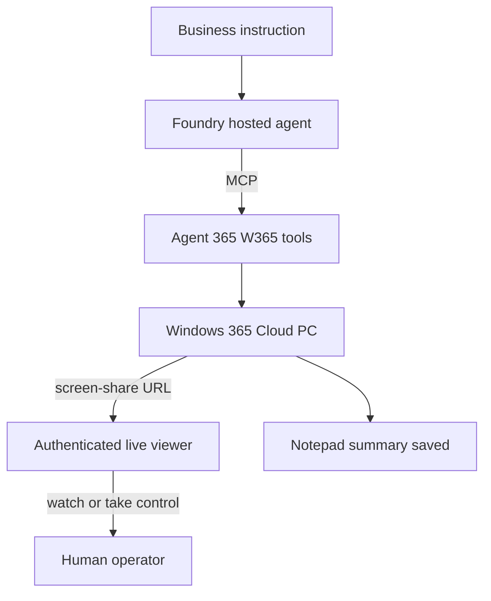
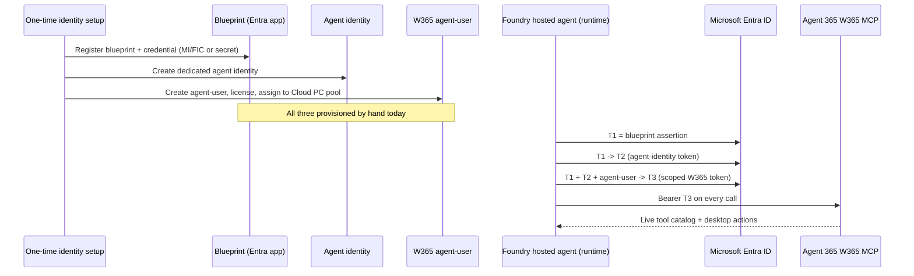

# Leadership demo: Foundry + Windows 365 computer-use agent

This is the narration script and supporting diagrams for a 3-minute demo aimed
at senior leadership. It explains the scenario, walks through the identity and
session-management work a customer has to do today to build an end-to-end
computer-use agent on Microsoft Foundry and Windows 365, runs the live demo,
and closes with the specific native-integration opportunity for Microsoft.

This document is presentation material. For the operational, repeatable demo
run itself (prerequisites, exact commands, evidence checklist, recovery), use
[`docs/LIVE-INVOICE-DEMO.md`](LIVE-INVOICE-DEMO.md). For the full component
and token-exchange design, use [`docs/ARCHITECTURE.md`](ARCHITECTURE.md) and
[`docs/AUTHENTICATION.md`](AUTHENTICATION.md).

A scrollable, click-through HTML version of this content for use while
recording is at
[`docs/presentation/leadership-demo.html`](presentation/leadership-demo.html).

## Question this demo answers

We already know a customer *can* build an end-to-end computer-use agent on
Foundry and Windows 365 today — that is not in question. What we wanted to
understand is **how easy or hard that actually is, and where Microsoft has a
concrete opportunity to close the gap with native integration.**

## Scenario

A Foundry-hosted agent receives one business instruction, opens a browser on a
real Windows 365 Cloud PC, reads an invoice visually off the screen the way a
person would, and writes a structured summary into Notepad — with a live,
authenticated viewer link a human can watch or take over at any time.



## Script — 3 minutes

### 0:00–0:25 — Setup

> "Quick framing before I run this. We already know a customer *can* build an
> end-to-end computer-use agent on Foundry and W365 — that's not the question.
> What we wanted to understand is how easy or hard that actually is today, and
> where Microsoft has a real opportunity to close the gap with native
> integration.
>
> So we built the real thing: a Foundry-hosted agent that opens a browser,
> reads a document off the screen, and acts on it — driving an actual Windows
> 365 Cloud PC through Agent 365's MCP tools. I'll walk through what it took,
> show it running, then tell you where it's harder than it should be."

### 0:25–1:10 — What it took

> "Three pieces of engineering, quickly.
>
> **Identity was the biggest one.** A hosted Foundry agent can't call Windows
> 365 with its own credentials — we had to build a three-hop token exchange.
> The blueprint credential becomes an assertion, that gets exchanged for an
> agent-identity token, and that gets exchanged again for a scoped agent-user
> token — that last one is the only thing W365 actually accepts.
>
> And identity wasn't just tokens. As part of it, we also had to **create a
> dedicated W365 agent-user, license it, and assign it to a Cloud PC pool** —
> separate from the agent identity itself. So before a single token gets
> exchanged, there are three distinct identities set up and wired together: a
> blueprint, an agent identity, and an agent-user.
>
> **Second, the MCP wrapper.** We connect to Agent 365's W365 tools, attach
> that token to every call, and pull the live tool catalog each session —
> nothing hardcoded.
>
> **Third, session lifecycle.** Before starting a Cloud PC session we record
> ownership and an idempotency key, so a flaky start never leaves an orphaned
> or duplicate session. A valid screen-share URL is our readiness signal.
> Anything ambiguous, we treat as unresolved, not success. We always clean up.
>
> One honest detail — we wanted this fully secretless, managed identity end to
> end. In the environment we tested, the first hop hit an Entra limitation, so
> we added a client-secret fallback for just that step. Stopgap, not the
> design we want."



### 1:10–2:15 — Live demo

> "Let's just run it."

Run the invoice-processing demo (see
[`docs/LIVE-INVOICE-DEMO.md`](LIVE-INVOICE-DEMO.md) for the full command and
preflight checks):

```powershell
pwsh -NoProfile -File .\scripts\Invoke-InvoiceProcessingDemo.ps1 `
    -Environment "<resource-prefix>-dev"
```

> "One instruction: process this invoice, save a summary. It immediately
> returns a live viewer link and a take-control link — the human-in-the-loop
> piece. Anyone can watch the agent work in real time, or take the mouse if
> something needs correcting."

Open the authenticated `/live/<opaque-id>` viewer link and show Edge loading
the invoice, the agent reading it, and Notepad being populated.

> "It's reading this off the screen — vendor, invoice number, total — same as
> a person would."

Wait for the terminal's completion marker.

> "There's our completion — file saved, path confirmed. One instruction in, a
> watchable session, a verified result out."

### 2:15–3:00 — Pain points and the ask

> "Here's the honest part. Identity alone spans four things — the Foundry
> runtime, the blueprint, the agent-identity/agent-user exchange we
> hand-provisioned, and W365's own authorization. All of it is bridged in our
> application code today, not the platform's.
>
> If Windows 365 becomes a first-class Foundry tool — with Foundry brokering
> that token exchange and handling agent-user provisioning automatically, the
> way it already does for other MCP connections — most of that identity setup
> disappears. What's left is the business logic and the session-safety
> guarantees, which we'd keep either way.
>
> It works today. It's just more identity plumbing than a customer should have
> to own — and that's a solvable platform gap."

## Today vs. native Foundry–W365 integration

| Responsibility | Today (this sample) | With native integration |
| --- | --- | --- |
| Blueprint credential, agent-identity token, agent-user token exchange (T1→T2→T3) | Application code | Platform-brokered (`AgenticIdentityToken`-style) |
| W365 agent-user creation, licensing, pool assignment | Manual one-time setup | Automated at agent deployment |
| Token caching, refresh, secure attachment to MCP calls | Application code | Platform-owned |
| Live tool catalog discovery, MCP connection | Application code | Application code (tool-specific) |
| Session ownership, idempotency, ambiguous-outcome recovery, cleanup | Application code | Remains application/runtime responsibility |
| Human-in-the-loop viewer (watch / take control) | Application code | Remains application/runtime responsibility |

## Presenter notes

- Say it like explaining to a peer, not reading a script.
- Run the invoke live — the viewer link and completion marker are what make
  this land; do not substitute a recording if a live run is possible.
- If asked about agent-user setup: "one-time provisioning today; should be
  automatic when Foundry deploys the agent."
- If asked about the client secret: "it only covers one of three token hops,
  it doesn't change the bigger ask."
- Keep the 4-minute cut (setup 0:30, build 0:45, demo 1:05, pain points 0:45)
  as a fallback if the live invoke needs more warm-up time; do not pad the
  pain-points close — it is the most important 45 seconds.
