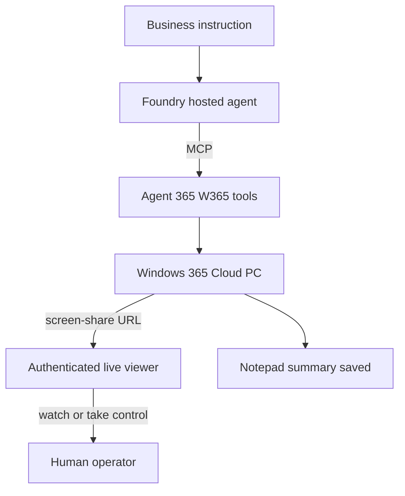
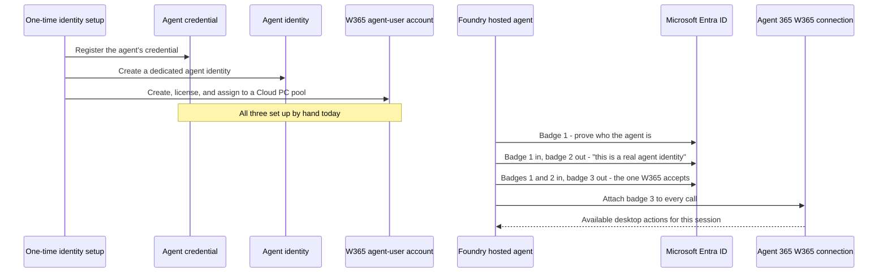

# Leadership demo: Foundry + Windows 365 computer-use agent

This is the narration script and supporting diagrams for a 3-minute demo aimed
at senior leadership. It explains the scenario, walks through the identity and
session-management work a customer has to do today to build an end-to-end
computer-use agent on Microsoft Foundry and Windows 365, runs the live demo,
and closes with the specific native-integration opportunity for Microsoft.

This document is presentation material. For the operational, repeatable demo
run itself (prerequisites, exact commands, evidence checklist, recovery), use
[`docs/LIVE-INVOICE-DEMO.md`](LIVE-INVOICE-DEMO.md). For the full component
and token-exchange design, use [`docs/ARCHITECTURE.md`](ARCHITECTURE.md) and
[`docs/AUTHENTICATION.md`](AUTHENTICATION.md).

A scrollable, click-through HTML version of this content for use while
recording is at
[`docs/presentation/leadership-demo.html`](presentation/leadership-demo.html).

## Question this demo answers

We already know a customer *can* build an end-to-end computer-use agent on
Foundry and Windows 365 today — that is not in question. What we wanted to
understand is **how easy or hard that actually is, and where Microsoft has a
concrete opportunity to close the gap with native integration.**

## Scenario

A Foundry-hosted agent receives one business instruction, opens a browser on a
real Windows 365 Cloud PC, reads an invoice visually off the screen the way a
person would, and writes a structured summary into Notepad — with a live,
authenticated viewer link a human can watch or take over at any time.



## Script — 3 minutes

### 0:00–0:25 — Setup

> "Quick framing before I run this. We already know a customer *can* build an
> end-to-end computer-use agent on Foundry and W365 — that's not the question.
> What we wanted to understand is how easy or hard that actually is today, and
> where Microsoft has a real opportunity to close the gap with native
> integration.
>
> So we built the real thing: a Foundry-hosted agent that opens a browser,
> reads a document off the screen, and acts on it — driving an actual Windows
> 365 Cloud PC through Agent 365's MCP tools. I'll walk through what it took,
> show it running, then tell you where it's harder than it should be."

### 0:25–1:10 — What it took

> "Three pieces of engineering, quickly.
>
> **Identity was the biggest one.** Think of it like getting a visitor badge
> for a secure building, except you need three badges, one after another,
> and each one only gets you the next one. We start with the agent's own
> credential — that gets us badge one. We hand badge one back to Microsoft
> Entra and get badge two, which says 'this is a real agent identity.' Then
> we hand back both badges and get badge three — the only one Windows 365
> actually lets through the door. We had to build that whole three-step
> handoff ourselves.
>
> And it's not just badges — we also had to **set up a dedicated W365 user
> account for the agent, license it, and put it in the right Cloud PC pool**,
> separately from the agent's own identity. So before any of that badge
> handoff even starts, there are three separate things to register and wire
> together: the agent's credential, its identity, and its W365 user account.
>
> **Second, the MCP wrapper.** We connect to Agent 365's W365 tools, attach
> that token to every call, and pull the live tool catalog each session —
> nothing hardcoded.
>
> **Third, session lifecycle.** Before starting a Cloud PC session we keep a
> record of who owns it and a way to tell "did that actually start or not" —
> so a flaky start never leaves us with an abandoned or duplicate desktop.
> Once we see a valid screen-share link back, that's how we know the desktop
> is really ready. If anything comes back unclear, we treat it as unresolved,
> never as success. And we always clean up after ourselves.
>
> One honest detail — we wanted this to need no stored secret at all, just
> the agent's built-in managed identity the whole way through. In the
> environment we tested, that first badge handoff hit a limitation on the
> Microsoft Entra side, so we added a plain client-secret fallback just for
> that one step. It's a stopgap, not the design we actually want."



### 1:10–2:15 — Live demo

> "Let's just run it."

Run the invoice-processing demo (see
[`docs/LIVE-INVOICE-DEMO.md`](LIVE-INVOICE-DEMO.md) for the full command and
preflight checks):

```powershell
pwsh -NoProfile -File .\scripts\Invoke-InvoiceProcessingDemo.ps1 `
    -Environment "<resource-prefix>-dev"
```

> "One instruction: process this invoice, save a summary. It immediately
> returns a live viewer link and a take-control link — the human-in-the-loop
> piece. Anyone can watch the agent work in real time, or take the mouse if
> something needs correcting."

Open the authenticated `/live/<opaque-id>` viewer link and show Edge loading
the invoice, the agent reading it, and Notepad being populated.

> "It's reading this off the screen — vendor, invoice number, total — same as
> a person would."

Wait for the terminal's completion marker.

> "There's our completion — file saved, path confirmed. One instruction in, a
> watchable session, a verified result out."

### 2:15–3:00 — Pain points and the ask

> "Here's the honest part. Identity alone touches four different things — the
> agent running inside Foundry, its credential, the badge handoff we had to
> hand-build to get it a real W365 user, and W365's own permission checks.
> All of that is stitched together in our application code today. Microsoft's
> platform doesn't do it for us yet.
>
> If Windows 365 becomes something Foundry supports out of the box — where
> Foundry does that badge handoff for us and sets up the W365 user account
> automatically, the same way it already smooths over other tool connections
> — most of that identity setup just goes away. What's left is the actual
> business logic, and the safety checks around the desktop session, which
> we'd want to keep either way.
>
> It works today. It's just more plumbing than a customer should have to
> build themselves — and that's a solvable gap for the platform to close."

## Today vs. native Foundry–W365 integration

| Responsibility | Today (this sample) | With native integration |
| --- | --- | --- |
| The three-step identity badge handoff (credential → agent identity → W365 user token) | Hand-built in application code | Handled automatically by the platform |
| Setting up the W365 user account, license, and Cloud PC pool for the agent | Manual one-time setup | Automated when the agent is deployed |
| Keeping tokens fresh and attaching them securely to every call | Application code | Platform-owned |
| Discovering what desktop actions are available each session | Application code | Application code (tool-specific) |
| Making sure a session isn't duplicated or abandoned, and always cleaning up | Application code | Remains the app's job either way |
| The human-in-the-loop viewer (watch / take control) | Application code | Remains the app's job either way |

## Presenter notes

- Say it like explaining to a peer, not reading a script.
- Run the invoke live — the viewer link and completion marker are what make
  this land; do not substitute a recording if a live run is possible.
- If asked about agent-user setup: "one-time provisioning today; should be
  automatic when Foundry deploys the agent."
- If asked about the client secret: "it only covers one of three token hops,
  it doesn't change the bigger ask."
- Keep the 4-minute cut (setup 0:30, build 0:45, demo 1:05, pain points 0:45)
  as a fallback if the live invoke needs more warm-up time; do not pad the
  pain-points close — it is the most important 45 seconds.
